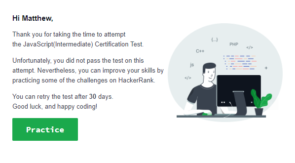

# HackerRank JavaScript Intermediate Skill Test

This helped me learn web development since it incorporated many lessons that we
learned in class. I think that it helped solidify the lessons we covered over
the semester by putting my knowledge to the test and learning new implementation
methods through the prompts. I thought that I had a better grasp on the subjects,
but found that I had to reference our previous lecture content. While I spent a
good chunk of the time trying to debug and truly understand the problem, this
was a good insight into interview questions in the future if I want to go into
web development. Working with Django in the past did not help me prepare for
all the funny-ness JavaScript throw at me with the assignments and simple
debugging.
